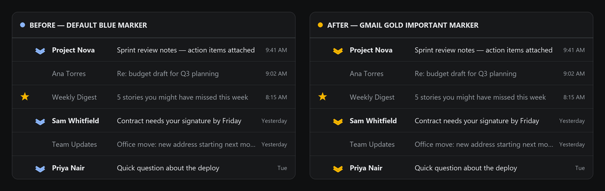
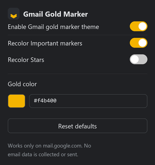

# Gmail Gold Important Marker

[](LICENSE)


A small, local-only Chrome/Chromium extension that restores a gold/yellow
appearance to Gmail's blue "Important" marker — and optionally the star
icon too. No build step, no dependencies, no network requests, no email
data ever read. Manifest V3, plain HTML/CSS/vanilla JS.

<p align="center">
  
</p>

<p align="center">
  
</p>

> The inbox screenshot above uses placeholder sender names and subjects
> for illustration only — this extension never reads real message
> content, and no real inbox data appears anywhere in this repo.

## Why I built this

Gmail's redesign recolored the "Important" marker from its classic
gold/yellow to a flat blue, which made it blend in with unread-message
blue and everything else in Gmail's UI — the whole point of the marker
(letting your eye pick out important mail at a glance) got weaker. I
wanted the old signal color back without giving up any of Gmail's
actual importance-detection logic, and without installing something
that pokes around in my inbox to do it. So this is deliberately tiny:
one content script, CSS custom properties for the color, and a popup —
nothing it doesn't need.

## Features

- Recolors Gmail's "Important" marker to a configurable gold color
  (default `#f4b400`) across Inbox, Search, Labels, Starred, Sent, and
  conversation/message-list views.
- Optionally recolors Gmail's star icon to the same gold, independently
  toggleable (off by default — most accounts' stars are still native
  gold; this is for accounts where Gmail has also turned the star blue).
- Pick the exact gold hue via a color picker or hex field; changes apply
  live, no reload.
- Master on/off switch fully removes all styling immediately, no reload
  required.
- Works with Gmail's light and dark themes.

## What it explicitly does NOT do

- Does not read, store, transmit, or process any email content or
  metadata (no subjects, senders, recipients, bodies, labels, or search
  terms are ever inspected).
- Does not call the Gmail API or any Google API.
- Does not make any network request — there is no remote code, no CDN
  dependency, no analytics/telemetry.
- Does not run on any site other than `mail.google.com`.
- Does not replace any Gmail control with a fake one; the real
  clickable element, its tooltip, and its keyboard/ARIA behavior are
  left completely intact — only CSS color properties are touched.

See [PRIVACY.md](PRIVACY.md) for the full privacy statement.

## Install

Not yet published on the Chrome Web Store — install it unpacked:

1. Clone or [download](../../archive/refs/heads/main.zip) this repo.
2. Open `chrome://extensions`.
3. Turn on **Developer mode** (top-right toggle).
4. Click **Load unpacked** and select the project folder.
5. Open or reload Gmail (`https://mail.google.com`).

Click the extension's toolbar icon to open the popup and adjust settings.

## Project structure

```
gmail-gold-important-marker/
├── manifest.json
├── content.css
├── content.js
├── popup.html
├── popup.css
├── popup.js
├── icons/
│   ├── icon16.png
│   ├── icon32.png
│   ├── icon48.png
│   └── icon128.png
├── screenshots/
│   ├── before-after.png
│   └── popup.png
├── README.md
├── PRIVACY.md
└── LICENSE
```

No `options.html` is included — every user-facing setting fits in the
popup, so a separate options page would be unnecessary surface area.

## Permissions used, and why

| Permission | Why |
|---|---|
| `storage` | Save your toggle states and chosen gold color via `chrome.storage.sync`. |
| `host_permissions: https://mail.google.com/*` | Required so the content script can run on Gmail and apply local CSS only there. |

No `tabs`, `activeTab`, `scripting`, `webRequest`, or Gmail/Google API
permission is requested. None are needed: the content script is
declared directly in `manifest.json` and Chrome injects it automatically
on matching Gmail pages, so no runtime scripting permission is required.

## How the recoloring works (technical)

Gmail renders these icons in a few different ways depending on build/
theme, so `content.js` and `content.css` use a layered, progressive
fallback:

- **Case A — inline SVG / CSS mask (`currentColor`) icons (preferred
  when present):** `content.css` overrides `color`, `fill`, and
  `background-color` on the tagged element and its `svg`/`path`/`use`
  children. This reproduces the exact chosen hex color.
- **Case B — background-image / `` / `::before`-sprite icons
  (the common case in current Gmail, see below):** when `content.js`
  can't find an inline `<svg>` or CSS mask, it adds a `ggim-use-filter`
  class and content.css applies a computed CSS `filter()` chain instead.
  This is an **approximation** — CSS filters cannot reproduce an
  arbitrary exact hex color on top of arbitrary source pixels — but was
  visually checked against Gmail's real icons (see below) and produces a
  clean gold rather than blue.
- **Case C — MutationObserver:** Gmail is a single-page app that
  swaps in new message rows without a full page reload. A debounced
  (`~200ms`), attribute- and childList-scoped `MutationObserver` re-syncs
  which elements are tagged whenever Gmail's DOM changes, so newly
  loaded rows and SPA navigation (Inbox → Search → Label, etc.) are
  picked up without a reload.

All extension-owned classes/attributes use the `ggim-` prefix
(**G**mail **G**old **I**mportant **M**arker) so they can never collide
with Gmail's own class names.

### Selector compatibility layer — verified live 2026-09-28

The actual Gmail element selectors live in one place: `SELECTORS` near
the top of [`content.js`](content.js). They key off `aria-label`
accessibility attributes rather than Gmail's own CSS class names, which
are generated by a build tool and change across releases.

These were confirmed against a real, signed-in Gmail inbox (English UI)
via DevTools, inspecting the live DOM without ever reading message
content:

- **Important marker:** container is a `role="switch"` element whose
  `aria-label` **starts with the word "Important"** in the true/marked
  state — not one fixed sentence. Gmail generates a different reason
  string per message depending on *why* its ranker thinks the message
  is important; confirmed variants include `"Important according to
  Google magic."` and `"Important because previous messages in the
  conversation were important."`, and there are almost certainly more
  (e.g. per-sender reasons) not seen during verification. An earlier
  version of this selector matched only the first exact string and
  silently left every other-reason message unrecolored — real-world
  testing caught this within minutes. `[aria-label^="Important" i]`
  (prefix match) fixes it; `"Not important"` doesn't share that prefix,
  so the unmarked state is still left alone, and requiring
  `role="switch"` excludes the left-nav "Important" folder link, which
  also happens to be labeled "Important" but carries no `role`. The icon
  itself is painted by a nested element's own `background-image` (a
  Google-hosted PNG), so it uses the `filter()` fallback (Case B), not
  exact-color SVG/mask.
- **Star:** container is a `role="button"` element with `aria-label=
  "Starred"` in the filled/true state — confirmed to be a plain boolean
  with no per-message variants (unlike the marker above), verified via
  Gmail's *Starred* view rather than by starring an email (kept
  read-only; no mailbox state was changed to verify this). The icon is
  painted via a `::before` pseudo-element `background-image` on that
  same element — also Case B. On the verification account the star was
  already native gold, not blue, which is why **Recolor Stars** defaults
  to off; enable it only if your account's star has also gone blue.
- `content.js`'s `resolveIconTarget()` walks a matched container's
  descendants looking for, in order: an inline `<svg>`, a CSS
  `mask-image`, an ``, an element's own `background-image`, then a
  `::before` `background-image` — and tags whichever one actually
  renders the icon, not just the outer `aria-label` element. This matters
  because in both verified cases, the colored pixels live on a
  *different* element than the one carrying the `aria-label`.

**Even so, this was one account, one UI language, one point in time.**
Gmail ships UI changes and A/B tests continuously. Before relying on this
day-to-day, or before any release:

1. Load it unpacked (see above) and open Gmail.
2. Open DevTools → Elements, and inspect an Important marker and a
   starred message's star icon in the message list.
3. Confirm their `aria-label` values and DOM structure (inline `<svg>`
   vs. mask vs. background-image vs. `` vs. `::before`) still match
   what `SELECTORS` / `resolveIconTarget()` in `content.js` expect.
4. Update `SELECTORS` (and nothing else) if the label text differs.
5. Non-English Gmail UI languages use translated accessibility label
   text, which is not covered by the default selectors; add the
   translated strings to `SELECTORS` if you use Gmail in a language
   other than English.

## Development

No build step, no dependencies, no `npm install`. Every file is plain
HTML/CSS/vanilla JS, ready to load as-is — see **Install** above to load
it unpacked. Changes to `content.js`/`content.css` take effect after
clicking the reload icon on the extension's card in `chrome://extensions`
and reloading Gmail; changes to `popup.*` take effect the next time the
popup is opened.

## Testing checklist

- [ ] Fresh install: defaults apply (enabled, markers on, stars off,
      `#f4b400`) with no configuration.
- [ ] Important marker renders gold in the **Inbox** list view, across
      **multiple different senders/messages** — not just the first one
      you check. Gmail assigns a different importance-reason string per
      message (see "Selector compatibility layer" above), so checking
      only one message can hide a selector regression.
- [ ] Important marker renders gold in **Search results**.
- [ ] Important marker renders gold under a **Label**.
- [ ] Important marker renders gold in **Starred**.
- [ ] Important marker renders gold in **Sent**.
- [ ] Important marker renders gold inside an open **conversation/message
      view** (if Gmail shows the marker there).
- [ ] Enabling **Recolor Stars** turns starred messages' stars gold;
      disabling it leaves stars at Gmail's native color.
- [ ] Changing the color via the **color picker** updates already-visible
      icons immediately, no reload.
- [ ] Typing a hex value in the **hex field** validates input and updates
      icons; invalid input shows an inline error and is not saved.
- [ ] **Reset defaults** restores the default color and toggle states.
- [ ] Toggling the **master switch off** removes all recoloring from
      Gmail immediately, no reload required.
- [ ] Toggling the master switch back **on** re-applies recoloring
      immediately.
- [ ] Works correctly in Gmail's **light theme**.
- [ ] Works correctly in Gmail's **dark theme**.
- [ ] Works correctly across Gmail's **density settings** (Default,
      Comfortable, Compact).
- [ ] Scrolling a long list (**dynamically loaded/virtualized rows**)
      picks up newly rendered rows without a manual refresh.
- [ ] Navigating between Gmail views via the left nav (SPA navigation,
      no full page reload) keeps recoloring correct in the new view.
- [ ] Preferences **persist after closing and reopening the browser**.
- [ ] No errors appear in the DevTools console attributable to this
      extension, and Gmail's own functionality (clicking to mark
      important, starring, tooltips, keyboard shortcuts) is unaffected.

## Packaging for the Chrome Web Store

1. Bump `"version"` (and `"version_name"` if used) in `manifest.json`.
2. From one level above the project folder, zip the folder's contents
   (not the folder itself as a nested subfolder) — for example, on
   Windows PowerShell from inside `gmail-gold-important-marker/`:
   ```powershell
   Compress-Archive -Path * -DestinationPath ..\gmail-gold-important-marker.zip -Force
   ```
3. Confirm the resulting `.zip` has `manifest.json` at its root, not
   nested inside another folder.
4. Upload the `.zip` in the [Chrome Web Store Developer
   Dashboard](https://chrome.google.com/webstore/devconsole).

## Publishing checklist

- [ ] Re-verify selectors against live Gmail (see section above) —
      **do this immediately before every release**, since Gmail can
      change its HTML/CSS at any time without notice.
- [ ] Run through the full **Testing checklist** above on a current
      Chrome stable release.
- [ ] Confirm `manifest.json` validates (valid JSON, correct paths).
- [ ] Confirm all four icon sizes (16/32/48/128) are present and load
      correctly in `chrome://extensions`.
- [ ] Fill in the Chrome Web Store listing using the draft text below.
- [ ] Submit for review.

**Known limitation:** Gmail can change its HTML/CSS structure at any
time without notice. If Gmail ships a redesign, the marker/star may
stop being recolored (it will simply fall back to Gmail's native
appearance — this extension is built to fail safely, never to break
Gmail's UI). If that happens, update the `SELECTORS` compatibility
layer in `content.js` per the instructions above.

<details>
<summary><strong>Draft Chrome Web Store listing text</strong></summary>

**Short description (< 132 characters):**
> Restores a gold/yellow color to Gmail's blue Important marker and star. 100% local, no email data read or sent.

**Full description:**
> Gmail Gold Important Marker is a small, local visual tweak for Gmail.
> It restores a classic gold/yellow color to Gmail's blue "Important"
> marker icon, and can optionally recolor the star icon to match.
>
> - Choose your own gold shade with a color picker or hex input
> - Toggle Important-marker recoloring and star recoloring independently
> - Works in Inbox, Search, Labels, Starred, Sent, and conversation views
> - Supports Gmail's light and dark themes
> - 100% local: no email content is ever read, no data is collected,
>   stored remotely, or transmitted anywhere, and no network requests
>   are made by this extension at all
> - Open source, plain HTML/CSS/JavaScript — no build step, no bundled
>   or minified code, nothing hidden
>
> This extension only runs on mail.google.com and only changes the
> color of two small icons. It never modifies, sends, or deletes any
> email, and never interacts with the Gmail API.

**Privacy practices answers:**
- Does this item collect or use user data? **No.**
- Does this item use remote code? **No.**
- Single purpose: **Recolor Gmail's Important marker (and optionally
  star) icon back to gold via local CSS.**

**Permission justification:**
- `storage`: store the user's on/off and color preferences locally
  (via `chrome.storage.sync`) so they persist across sessions.
- `host_permissions` for `https://mail.google.com/*`: required for the
  content script to apply local CSS changes on Gmail; no broader host
  access is requested.

**Suggested screenshot plan:**
1. Gmail inbox showing several gold Important markers next to normal
   rows, light theme.
2. Same view in Gmail dark theme.
3. The extension popup open, showing all toggles and the color picker.
4. Before/after comparison (Gmail's default blue marker vs. this
   extension's gold marker) as a single side-by-side image.

**Single-purpose policy explanation:**
> This extension has one purpose: locally recoloring Gmail's Important
> marker and star icons. It requests the minimum permissions needed for
> that purpose (`storage` for preferences, and host access limited to
> `mail.google.com`), performs no other function, and makes no network
> requests.

</details>

## Contributing

Issues and pull requests are welcome — especially selector fixes when
Gmail changes its DOM (see "Selector compatibility layer" above for
exactly what to check and where to update it). Please keep changes
dependency-free and within the existing permission scope; anything that
would require a new permission should explain why in the PR description.

## License

[MIT](LICENSE)
